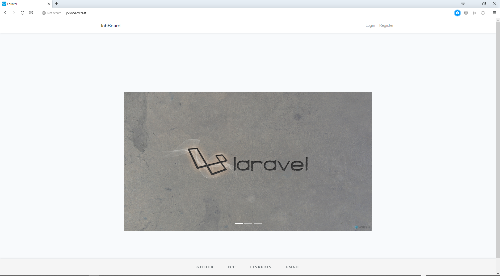
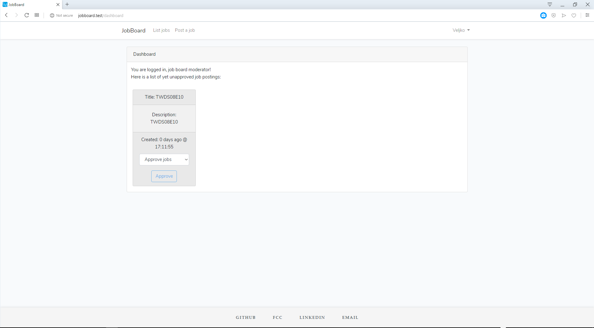
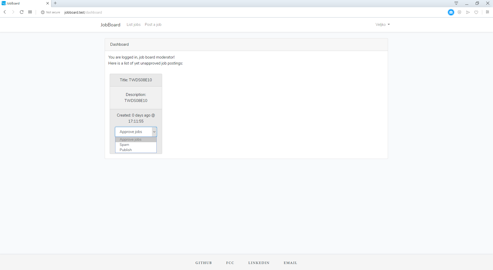
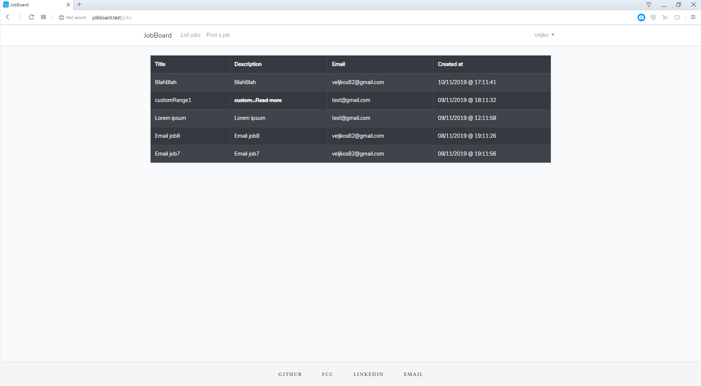
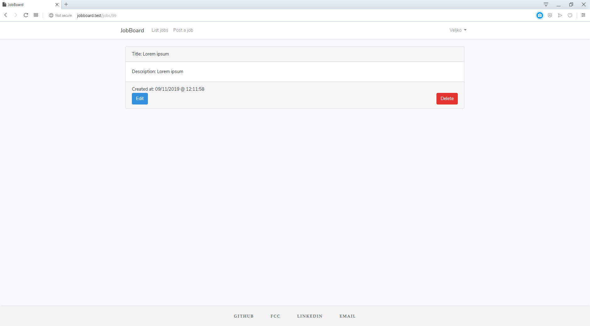
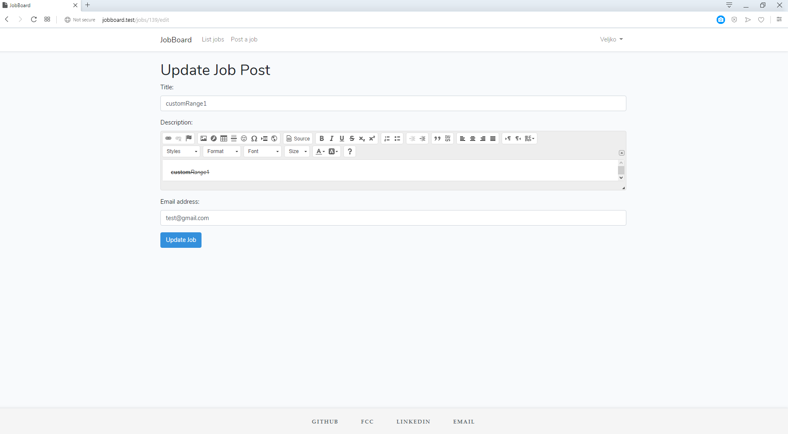
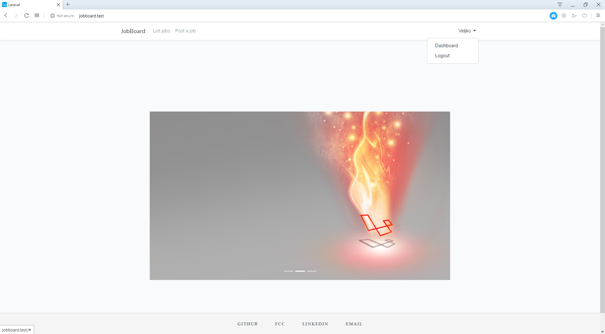
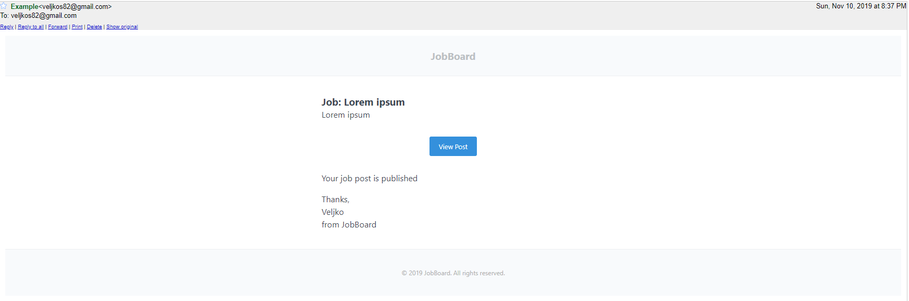

# JobBoard

## Getting Started:
Put this into root of your server. I used xammp, but there is no trouble to make it work with lamp stack.

## Prerequisites:
You'll need a xampp installation, composer installed and nmp package manager. 

No third party libraries have been used.

## Installing:

Install(in this order):

1. xampp(server environment)
2. composer(Laravel package manger)
3. gitbash(for running terminal)
4. npm(node package manager which can also been used for React and sass)
5. Run xampp, both apache and mysql
6. Create db named `jobboard`
7. In .env file set these variables
```
DB_DATABASE=jobboard
DB_USERNAME=root
DB_PASSWORD=""
```
8. Run migrations
9. Change to gitbash as default terminal
10. In terminal, type: `npm run watch` to compile sass files.
11. If you done all correctly, type in browser `jobboard.test`.

## Usage:

After starting application, you'll be presented with this image:


You either sign in or register if not done so.

After login, you'll see dashboard where you can see your role and and above it an navbar. Depending on role, you might see a "card" which may hold pending job posts. This you can se if you're "job board moderator". If you're first registred user, you'll automatically receive this role.

As seen in this image:


In this image, you are seeing a dropdown menu from whom's options you can choose to either approve or disprove job post. 


In options of navbar you can interact i.e. create or list jobs, independently of the role you have. 

Listing of jobs are presented in the table. By clicking on any of the rows, you'll be taken to any particular job post(approved).



An image depicting particular post. If you're a creator of this post, you're presented with the options of modifying it or delete it altogether. 



Deleting is followed by redirect to main listing page.
Update is somewhat different.

An image depicting options for modifying job post. 


Creating a job is similar to updating, but since you create, form doesn't come with prefilled values and there's a different inscription on submit button.

This image is depicting a welcome page and if you are logged, in the top right corner small dropdown which can lead you to either dashboard or you can logout.



#### PS: If you're moderator an depending if user posts his first job post, you'll be notified by email. 
#### Until first post for user get approved, mod will receive these notifications.
#### On the other hand, user will receive notifications, depending of the status, if it's approved or not i.e. pending to be.

An example image depicting of custom email notification template. Depending on context image can vary.


## Technologies used:

1. Laravel
2. Javascript
3. Sass
4. Css
5. Html

### My email:
veljkos82@gmail.com


